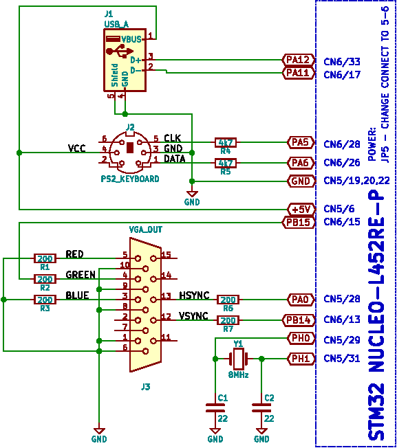

# VGA_STM32L452

## Motivace
Začaly se mi tu hromadit monitory VGA s rozměrem 4:3, tak jsem přemýšlel jak je využít.
Zkusil jsem generovat monochromatický signál na Nucleo kitu, osazeném STM32L452. Je to
dost na hraně, pro výstup je použito SPI pomocí DMA, časování je však natolik kritické,
že to funguje jen když je osazen krystal a kód běží z RAM.

Pro ladění (defaultní stav) je v procesoru nahrán do flash krátký kousek kódu z adresáře
base-ram. Vlastní kód je pak nahráván do RAM, odkud také běží. Je to jednoduchý hack,
který umožňuje ladit v RAM a nemusí se čarovat s BOOT options. Lze to dostat i permanentně
do flash, viz PMD85/flash.patch. I tak kód běží celý z RAM, tj. musí se tam vejít.
Zkoušel jsem dostat do RAM jen kritické části, ale příliš to nepomohlo, cache flash
asi není dostatečně deterministická a přerušení pak trochu rozmazávají pixely.

## PMD85
V tomto adresáři je jednoduchý emulátor PMD85v2A, včetně programů MONITOR2A a BASICGV2A. Je to jen základ,
emulace je založena na kódu z [githubu](https://github.com/mborik/GPMD85Emulator). Jde do
toho přidávat i vlastní programy (BASIC i binárky), ale utilita je jen pro Linux. Možná
dodělám i nějaké úložiště v hardware, protože mít to připojené k PC je dost nesmysl a bez
toho je to jen na vyzkoušení, že to fakt chodí. I když jde do toho nahrát nějakou hru, snad by to dítě
na chvíli zabavilo - vidělo by, jakou primitivní zábavu jsme měli za starých časů.

## Voltmeter
To je jen taková blbina, ale zajímavě vypadá. Čte to napětí na PA2 a zobrazuje ho

Má to FIR filtr, který napodobí kývání ručičky. Nastavovat tím nějakou veličinu je opravdu
příjemnější než při použití digitálního měřidla.

TODO: Textový displej něco jako VT52.
