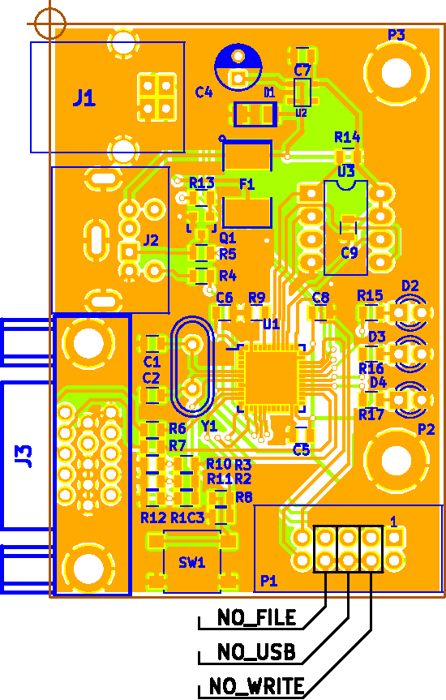

# VGA_STM32L452 V2

## Motivace
Začaly se mi tu hromadit monitory VGA s rozměrem 4:3, tak jsem přemýšlel jak je využít.
Zkusil jsem generovat monochromatický signál na Nucleo kitu, osazeném STM32L452. Je to
dost na hraně, pro výstup je použito SPI pomocí DMA, časování je však natolik kritické,
že to funguje jen když je osazen krystal a kód běží z RAM. Ve verzi 2 byl vytvořen vlastní
hardware, protože ty dráty na kitu ve spojení s rychlými SPI sběrnicemi nedělají dobrotu.
V sekci hardware je tedy schema a celý návrh desky, včetně dat pro výrobu - skutečně
je to podle toho vyrobeno a dá se to poměrně primitivními prostředky osadit.


Pro ladění (defaultní stav) je v procesoru nahrán do flash krátký kousek kódu z adresáře
base-ram. Vlastní kód je pak nahráván do RAM, odkud také běží. Je to jednoduchý hack,
který umožňuje ladit v RAM a nemusí se čarovat s BOOT options. I tak kód běží celý z RAM, tj. musí se tam vejít.
Zkoušel jsem dostat do RAM jen kritické části, ale příliš to nepomohlo, cache flash
asi není dostatečně deterministická a přerušení pak trochu rozmazávají pixely.

## bootloader



Základní firmware, který by měl být nahrán do flash procesoru. Je možné ho trochu konfigurovat zkratovými propojkami,
slouží k tomu piny, vyvedené na konektor P1. Pokud není žádná z propojek osazena, program
funguje základním způsobem - po připojení napájecího napětí se pokusí enumerovat se jako USB MSC,
když se mu to nepovede, zkusí z kořenového adresáře FIRMWARE natáhnout do RAM od adresy 0x2000_0000
první soubor, který v tomto adresáři najde a pokud se mu to podaří, spustí ho. Propojky modifikují
chování zhruba následujícím způsobem:

* NO_FILE  - nenatáhne soubor do paměti - pro ladění, podobné jako hack base-ram
* NO_USB   - nečeká na enumeraci USB, je tedy možné spustit uživatelský program i když je to připojeno k PC
* NO_WRITE - MSC se chová jako read only zařízení - R/W přístup často zbytečně přepisuje blok 0 (dirty bit)


## PMD85
V tomto adresáři je jednoduchý emulátor PMD85v2A, včetně programů MONITOR2A a BASICGV2A. Je to jen základ,
emulace je založena na kódu z [githubu](https://github.com/mborik/GPMD85Emulator). Ve verzi 2 je přidána
jednotka PMD32 s daty ve SPI flash. To umožnilo přidat bootloader, který když nahrajeme do procesoru,
pak je zařízení schopné pracovat (po připojení k PC) jako USB mass storage device, na SPI flash
se dá vytvořit FAT filesystém příkazem
```
mkfs.vfat -I -v -F 12 -f 1 -r 128 -S 4096 -s 1 -n LOADER /dev/sdX
```
nakopírovat do flash souborovou strukturu PMD32 (př. /PMD85/cpu/image/fil) a do adresáře FIRMWARE dát
vlastní binárku (linkovanou pro běh z RAM). Pokud pak připojíme desku jen na USB napáječ (aby nedošlo k enumeraci USB),
binárka se nabootuje a spustí. Binárka může být třeba i ten voltmetr.
Pro ladění je přidán Qt4/5 projekt devel, který používá stejné soubory cpu jako firmware. Ladit to přímo v tom
ARM čipu není zase taková sranda a co funguje na jedné platformě, funguje zpravidla i na jiné, pokud se to překládá gcc.
Pozn. Ten FAT filesystém a i USB MSC je trochu nestardní, používá délku bloku 4096B (kvůli použití flash - NOR).

## Voltmeter
To je jen taková blbina, ale zajímavě vypadá. Čte to napětí na PA2 a zobrazuje ho


Má to FIR filtr, který napodobí kývání ručičky. Nastavovat tím nějakou veličinu je opravdu
příjemnější než při použití digitálního měřidla.

## TRNG
Protože hardware má vyvedeno USB a procesor obsahuje docela dobrý generátor náhodných
čísel, byla škoda to nějak nevyužít. Popis má vlastní README.md v adresáři TRNG.

## VT100
Textový displej podobný VT100. Escape sekvence jsou dost zjednodušené, stejně tak kódy klávesnice.
Default se to navenek chová jako USB CDC zařízení, ale je možné použít jako vstup/výstup USART,
jehož piny TxD (PA2) a RxD (PA3) jsou vyvedeny na konektor. Provedeme to příkazy
```
make clean
patch -p2 < usart.patch
make
```
Funguje to dobře např. pokud to použijeme jako konzoli v simulaci [historických počítačů](https://github.com/simh/simh),
kde jdou data na konzoli relativně pomalu. Jako konzole linuxu pomocí getty USB CDC dělá neplechu - dat
přichází moc najednou a displej problikává, protože mu vypadne synchonizace. Umravnit to by bylo moc práce.
USART použitelný vcelku je, ale zase - Linux používá i escape sekvence, které nejsou implemetovány. A další
věcí je, že formát obrazovky je jiný než u původního VT100. V podstatě jsem to dělal jen proto,
aby mi v simulaci PDP11 s OS RSX11M běželo RMD. Prostě vzpomínky na svět SMEP. Ono to nezaškodí podívat
se těch pár desítek let zpátky - člověk si uvědomí jak se od té doby zlepšil komfort práce s počítačem.
A zároveň jak málo se změnily základní principy - i tam bylo C-čko, textový editor a příkazová řádka
s nějakým procesorem (možnost skriptování příkazů). RSX11M byl první OS hodný toho jména se kterým jsem
se setkal, měli jsme tu výhodu, že už tenkrát jsme mohli používat originální verzi, kerá se dnes dá sehnat
na Internetu. Jen se tehdy nedalo používat C-čko, většina programů se vytvářela v assembleru, dal se používat
Fortran a Basic. C-čkový překladač nebyl a ten co je pro RSX11M dnes dostupný na webu je stejně primitivní,
ne tak propracovaný jako Fortran. C-čko se prostě začalo rozvíjet až s příchodem UNIXu.
